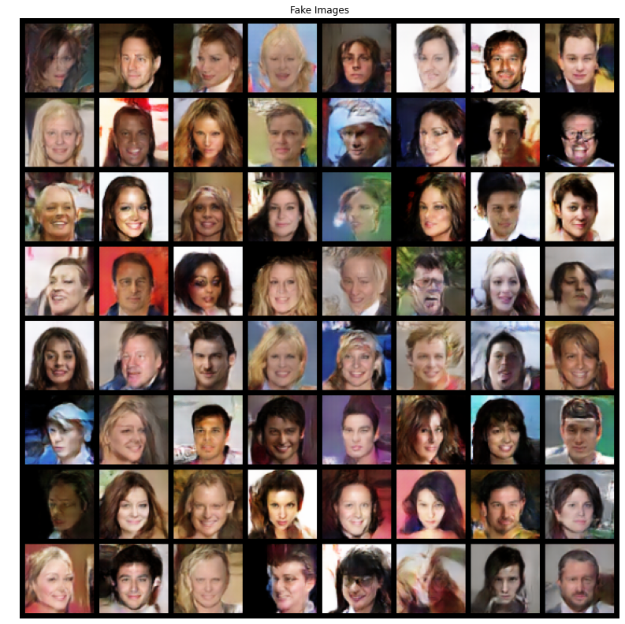
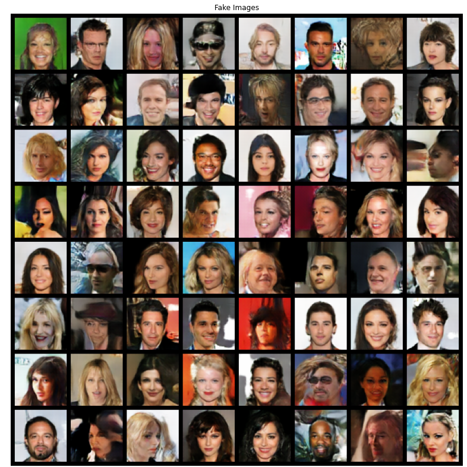
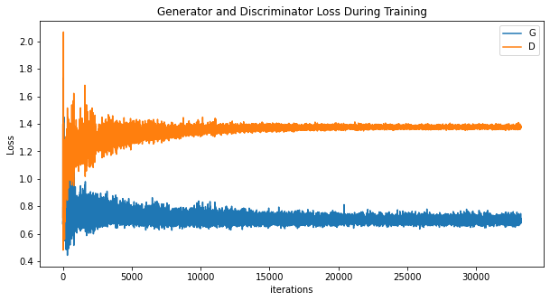

# Pytorch DCGAN with SN 
[](https://www.codefactor.io/repository/github/lunayht/pytorch-dcgan-with-sn) [](https://github.com/psf/black)

Deep Convolutional Generative Adversarial Networks with Spectral Normalization using CelebA dataset.

## System Requirement
* System with Linux or OSX
* NVIDIA GPU is strongly recommended for speed however CPU is supported but training will be slow.

## Execution 
1. ```sh setup.sh```
2. ```python main.py --num_epochs 5``` (Use ```-h``` for help)

You may run the program using DCGAN-with-SN.ipynb as well. 

## Results
| Number of Epochs | Fake Images | FID Score |
|      :----:      |   :-----:   |   :---:   |
| 20 |  | 116.44 |
| 100 |  | 34.74 |

### Loss Graph During Training


## References
* Pytorch DCGAN Tutorial: https://pytorch.org/tutorials/beginner/dcgan_faces_tutorial.html
* https://github.com/christiancosgrove/pytorch-spectral-normalization-gan
* https://github.com/martinarjovsky/WassersteinGAN

## Papers
* Vanilla GAN by [Goodfellow et al.](https://papers.nips.cc/paper/5423-generative-adversarial-nets.pdf)
* Deep Convolutional GAN by [Radford et al.](https://arxiv.org/pdf/1511.06434.pdf)
* Spectral Normalization GAN by [Miyato et al.](https://openreview.net/pdf?id=B1QRgziT-)
* Fréchet Inception Distance (FID) score [Heusel et al.](https://arxiv.org/pdf/1706.08500.pdf)
